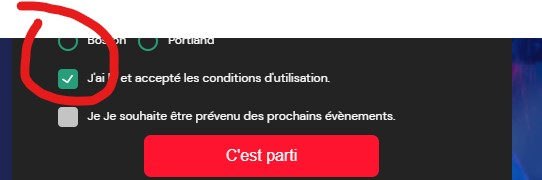
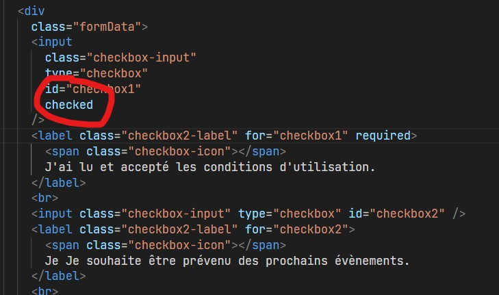
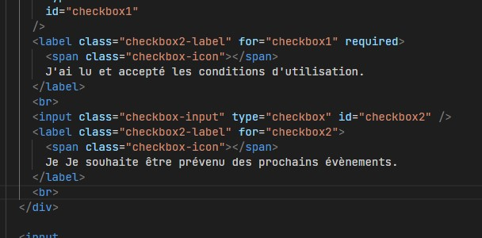
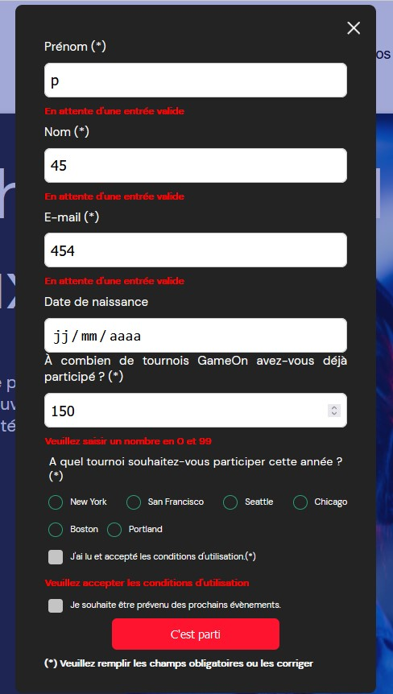

# Projet de formation

## Lien du site une fois fini : https://kevinozkaraca.github.io/Projet_Javascript_Game/

## Instructions :

- utiliser des fichiers séparés pour le HTML, le CSS et le JavaScript ;
- toujours commenter ton code (décrire chaque fonction et chaque classe, ainsi que les parties du code qui nécessitent plus de détails) ;
- tester manuellement les fonctionnalités, les entrées de formulaire et l'affichage responsive.

## Tache :

🔴 Tests manuels

Visualiser et tester l'interface utilisateur dans les dernières versions de Chrome et de Firefox, ainsi que dans les versions mobile et desktop. Corriger les erreurs d'affichage existantes.

Tester toutes les fonctionnalités des boutons et des entrées de formulaire (tester les valeurs correctes et incorrectes)

🔴 Ajouter confirmation quand envoi réussi

Après une validation réussie, inclure un message de confirmation de la soumission réussie pour l'utilisateur (ex. "Merci ! Votre réservation a été reçue.")

🔴 Ajouter validation ou messages d'erreur

Des messages d'erreur spécifiques doivent apparaître sous l'entrée qui n'est pas correcte. Les messages d'erreur doivent s'afficher sous le champ de saisie associé. Exemples :

- "Veuillez entrer 2 caractères ou plus pour le champ du nom."
- "Vous devez choisir une option."
- "Vous devez vérifier que vous acceptez les termes et conditions."
- "Vous devez entrer votre date de naissance."

🔴 Implémenter entrées du formulaire

- (1) Lier les labels aux entrées dans le HTML en utilisant les attributs "for" et "id" dans le code existant. Corriger le code HTML quand nécessaire.
- (2) Utiliser du JavaScript pur (pas de jQuery) pour terminer le formulaire

Le formulaire doit être valide quand l'utilisateur clique sur "Submit"
Les données doivent être saisies correctement

- (1) Le champ Prénom a un minimum de 2 caractères / n'est pas vide.
- (2) Le champ du nom de famille a un minimum de 2 caractères / n'est pas vide.
- (3) L'adresse électronique est valide.
- (4) Pour le nombre de concours, une valeur numérique est saisie.
- (5) Un bouton radio est sélectionné.
- (6) La case des conditions générales est cochée, l'autre case est facultative / peut être laissée décochée.
  Conserver les données du formulaire (ne pas effacer le formulaire) lorsqu'il ne passe pas la validation.

🔴 TODO : fermer la modale :

Ajouter la fonctionnalité au bouton (x)

# REALISATION :

## Tests manuels :

### AVANT

### APRES

### AVANT

### APRES

- Une faute d'ortographe et une div en trop dans le code

## Ajouter confirmation quand envoi réussi :

## Ajouter validation ou messages d'erreur :

## Implémenter entrées du formulaire :

## TODO : fermer la modale :

✅ Ajouter la fonctionnalité au bouton (x)

