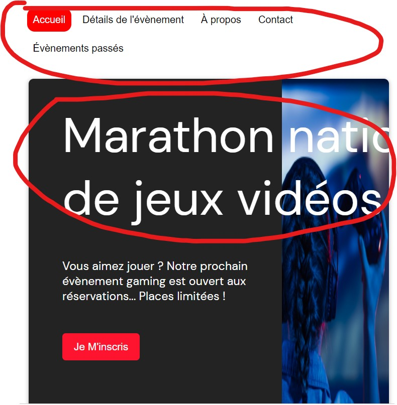
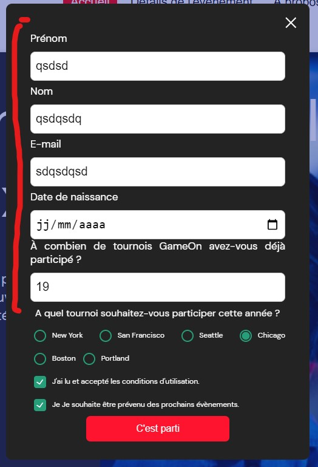
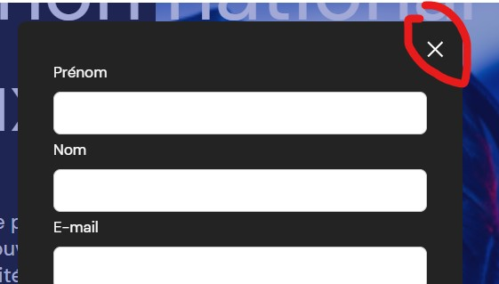
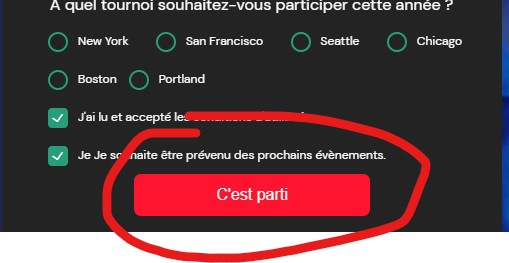

# Réalisation de test

## 1. L'image peut etre améliorée

## 2. Ajouter des Regex

## 3. Permettre la fermeture de la fenetre modale

## 4. Empécher la possibilité de confirmation tant que le formulaire n'est pas valide

